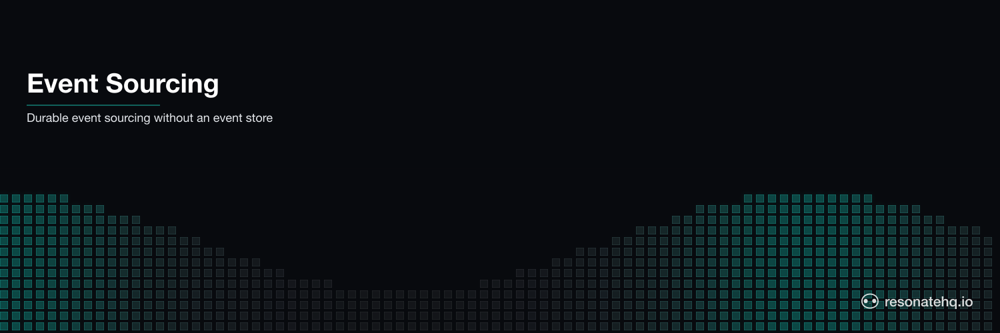

<p align="center">
  <picture>
    <source media="(prefers-color-scheme: dark)" srcset="./assets/banner-dark.png">
    <source media="(prefers-color-scheme: light)" srcset="./assets/banner-light.png">
    
  </picture>
</p>

# Event Sourcing / CQRS Lite

Durable event stream processing with crash recovery. Processes a sequence of domain events into a state projection — one durable checkpoint per event. If the projection writer crashes at event 5, events 0–4 are cached. Processing resumes at event 5. No event is applied twice.

## What This Demonstrates

- **Exactly-once event processing**: each event application is an independent checkpoint; crash at event 5, events 0–4 are cached and not re-applied
- **State projection (CQRS read model)**: current account state derived by applying events in order — no shared mutable state, no coordination needed
- **Pure projection function**: `applyEvent(state, event) → nextState` — deterministic, testable, no database required for the logic
- **Crash recovery without offset tracking**: Resonate handles "where did we leave off" automatically; no Kafka offset management, no checkpoint tables

## How It Works

The event loop is a generator function with one `ctx.run()` per event:

```typescript
export function* processEventStream(ctx: Context, userId: string, events: UserEvent[], crashAtIndex: number) {
  let projection = initialProjection(userId);

  // Process each event as an independent durable checkpoint.
  // On crash: completed events return their cached projection state.
  // Loop resumes at the first uncached event. Zero re-processing.
  for (let i = 0; i < events.length; i++) {
    projection = yield* ctx.run(applyEvent, i, events[i], projection, crashAtIndex);
  }

  return { userId, eventsProcessed: projection.eventsProcessed, finalProjection: projection };
}
```

That's the entire "event sourcing" infrastructure. One for-loop with `yield*`.

The `applyEvent` function is pure: takes current state + one event, returns next state. No database writes, no side effects — just a switch statement over event types. Wrapped in `ctx.run()`, it becomes a durable step.

### Domain Events

8 events representing an account lifecycle:

```
UserRegistered       → name, email set
ProfileUpdated       → name updated
SubscriptionActivated → subscription: "active"
OrderPlaced (×2)     → 2 active orders tracked
OrderShipped         → ord_001 moves active → shipped
OrderCancelled       → ord_002 moves active → cancelled count
SubscriptionRenewed  → renewals counter incremented
```

### Why the loop is the processor

There is no external event-routing layer for this example. Events arrive as an array; the generator iterates; each event gets one `yield*` call that returns a checkpointed result. The workflow itself IS the processor. For Kafka-sourced events where the broker routes per-key to a handler, see `example-openai-deep-research-agent-kafka-ts`.

## Prerequisites

- [Bun](https://bun.sh) v1.0+

No external services required. Resonate runs in embedded mode.

## Setup

```bash
git clone https://github.com/resonatehq-examples/example-event-sourcing-ts
cd example-event-sourcing-ts
bun install
```

## Run It

**Happy path** — process all 8 events into a consistent projection:
```bash
bun start
```

```
=== Event Sourcing / CQRS Projection Demo ===
Mode: HAPPY PATH (process all 8 events into account projection)
Events: 8

  [event 00]  UserRegistered  →  name="Alice Chen"
  [event 01]  ProfileUpdated  →  name="Alice Chen-Watson"
  [event 02]  SubscriptionActivated  →  name="Alice Chen-Watson" sub=active
  [event 03]  OrderPlaced  →  ... sub=active orders=1 active=[ord_001]
  [event 04]  OrderPlaced  →  ... sub=active orders=2 active=[ord_001,ord_002]
  [event 05]  OrderShipped  →  ... active=[ord_002] shipped=[ord_001]
  [event 06]  OrderCancelled  →  ... shipped=[ord_001]
  [event 07]  SubscriptionRenewed  →  ... renewals=1

=== Final Projection ===
{
  "name": "Alice Chen-Watson",
  "subscription": "active",
  "subscriptionRenewals": 1,
  "totalOrders": 2,
  "cancelledOrders": 1,
  "shippedOrders": ["ord_001"],
  "eventsProcessed": 8,
  "wallTimeMs": 443
}
```

**Crash mode** — projection store fails writing event 05 (OrderShipped):
```bash
bun start:crash
```

```
  [event 00]  UserRegistered  →  name="Alice Chen"
  [event 01]  ProfileUpdated  →  name="Alice Chen-Watson"
  [event 02]  SubscriptionActivated  →  ... sub=active
  [event 03]  OrderPlaced  →  ... orders=1 active=[ord_001]
  [event 04]  OrderPlaced  →  ... orders=2 active=[ord_001,ord_002]
  [event 05]  OrderShipped  ✗  (projection store write failed)
Runtime. Function 'applyEvent' failed with 'Error: ...' (retrying in 2 secs)
  [event 05]  OrderShipped (retry 2)  →  ... active=[ord_002] shipped=[ord_001]
  [event 06]  OrderCancelled  →  ... shipped=[ord_001]
  [event 07]  SubscriptionRenewed  →  ... renewals=1

Notice: events 00-04 each logged once (cached before crash).
Event 05 (OrderShipped) failed → retried → succeeded.
The projection is consistent — no event was applied twice.
```

## What to Observe

1. **No re-processing**: events 00–04 each appear exactly once in crash mode. On retry, the loop replays but those events return their cached projection state immediately.
2. **Consistent final projection**: the crash mode and happy path produce identical final projections — 2 orders, 1 shipped, 1 cancelled, 1 renewal.
3. **Retry is the SDK, not your code**: `Runtime. Function '...' failed (retrying in N secs)` is Resonate. You don't write retry logic.
4. **Scale this up**: change the event list to 10K events — the pattern is identical. Each event is one durable checkpoint.

## File Structure

```
example-event-sourcing-ts/
├── src/
│   ├── index.ts    Entry point — Resonate setup and demo runner
│   ├── workflow.ts Event stream processor — the for-loop with yield*
│   └── events.ts   Event types, projection logic, sample data
├── package.json
└── tsconfig.json
```

**Lines of code**: ~402 total (including 8 event type definitions), ~25 lines of event processing logic (workflow.ts minus comments).

## Exactly-once via the promise store

Each `ctx.run(event)` call registers a durable promise keyed by event ID. A second invocation with the same event ID returns the cached result — the event's side effects run exactly once across the entire lifetime of the workflow, including across crashes and restarts. No separate idempotency table, no broker-side deduplication, no "checkpoint interval" to tune.

Resume-from-crash is automatic: the generator replays from the top on restart, each `yield*` short-circuits on completed events, and execution resumes at the first unprocessed event.

## Learn More

- [Resonate documentation](https://docs.resonatehq.io)
